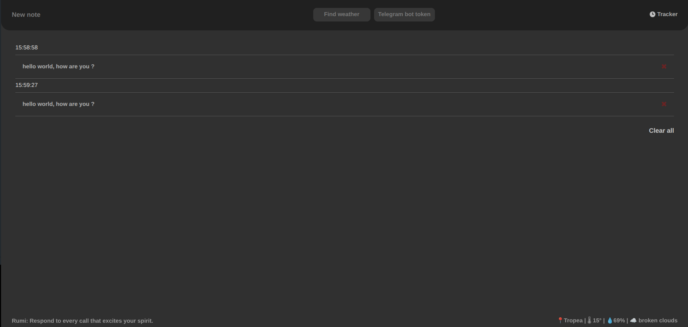
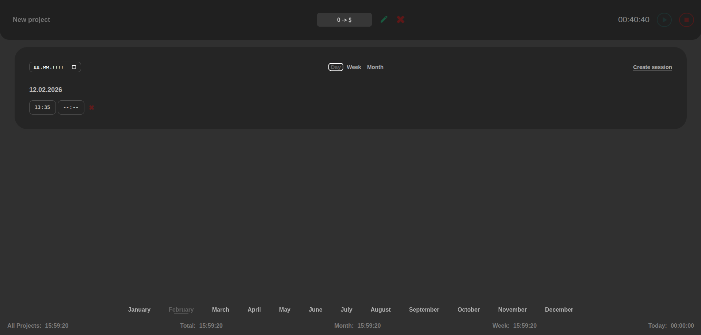

# 🚀 dp ~ Note & Track

> Minimal productivity dashboard built with **Vanilla JavaScript**  
> Notes • Weather • Telegram Bot Integration • Multi-Project Time Tracker • Advanced Statistics  
> 100% Client-Side • No Backend

---

## 📸 Preview

<p align="center">
  
</p>

<p align="center">
  
</p>

---

# 🧠 Project Overview

**dp ~ Note & Track** is a fully client-side productivity dashboard.

The application combines:

- 📝 Notes manager
- 💬 Personal Telegram Bot integration
- 🌦 Weather search with reverse geocoding
- 🎲 Random motivational quotes
- ⏱ Multi-project time tracking
- 📊 Real-time statistics engine
- 💾 Persistent local storage

Everything runs in the browser.  
No backend. No database. No external server logic.

---

# ✨ Features

## 📝 Notes Dashboard

- Add / delete notes
- Auto timestamp for each note
- Clear all tasks
- Send note directly to your personal Telegram bot
- Custom Telegram message sender
- Weather search by city
- Reverse geocoding (coordinates → locality)
- Random quote generator
- Persistent state via LocalStorage

---

## 💬 Telegram Bot Integration

Users can connect their own Telegram bot by entering:

- Bot Token
- Chat ID (auto-detected)

### 🔐 Security Model

- Token is stored only in browser LocalStorage
- No backend server
- No third-party database
- All API requests are sent directly from the client to Telegram API

The token never leaves the user's environment except for direct Telegram API calls.

---

## ⏱ Time Tracker Page

- Create / rename / delete projects
- Start / Stop tracking
- Persistent running timer after page reload
- Manual session creation
- Edit session start / end time
- Prevent session overlap
- Filter statistics:
  - Today
  - Last 7 days
  - Selected month
  - Total per project
  - Global total across all projects

---

# 🏗 Architecture

The application follows a single state architecture pattern:

> **Single Source of Truth → appState**

### Notes App State

```js
appState = {
	tasks: [],
	weather: {
		lat,
		lon,
		temp,
		humidity,
		city,
		weather,
	},
	token,
	chatId,
	locality,
	quote,
};
```

### Tracker App State

```js
appState = {
	projects: [
		{
			id,
			name,
			totalTimer,
			sessions: [
				{ start, end },
				{ start, end },
			],
		},
	],
	currentProjectId,
	isTracking,
	activeTrackingId,
	selectedDate,
	selectedMonth,
	selectedYear,
	viewMode,
	monthsNames: [],
};
```

All UI rendering is derived from state.

---

# 💾 Data Persistence

```js
localStorage.setItem('myApp', JSON.stringify(appState));
```

- Instant state saving
- Full recovery after refresh
- Running timer restores using timestamp difference logic

Timer recovery example:

```js
Date.now() - session.start;
```

---

# 📊 Statistics Engine

Statistics are calculated dynamically instead of stored.

Available scopes:

| Scope  | Description           |
| ------ | --------------------- |
| Today  | Current day total     |
| Week   | Last 7 days           |
| Month  | Selected month        |
| Total  | Current project total |
| Global | All projects combined |

Time format:

```
HH:MM:SS
```

---

# 🔌 APIs Used

- Telegram Bot API
- OpenWeather API
- DummyJSON Quotes API
- BigDataCloud Reverse Geocoding API

All API requests are handled asynchronously using `async / await`.

---

# 🛠 Tech Stack

| Technology   | Purpose           |
| ------------ | ----------------- |
| HTML5        | Structure         |
| CSS3         | Styling           |
| Vanilla JS   | Application logic |
| LocalStorage | Persistence       |
| REST APIs    | External data     |

Zero frameworks.  
Zero build tools.  
Pure browser architecture.

---

# 🚀 How To Run

1. Clone repository
2. Open `index.html`
3. Open `tracker.html`

No installation required.

---

# 🧩 Engineering Challenges Solved

### 1️⃣ Persistent Timer Logic

Timer continues correctly after page reload.

### 2️⃣ Session Overlap Prevention

Prevents logical time conflicts between sessions.

### 3️⃣ Real-Time Statistics Calculation

All totals calculated dynamically based on filtered session data.

### 4️⃣ Secure Client-Side Telegram Integration

Direct API communication without backend server.

### 5️⃣ State-Driven Rendering

Full re-render on state change without frameworks.

---

# 📈 Future Improvements

- Optional backend sync
- Data export (CSV)
- Charts & analytics
- PWA support
- Dark / Light theme toggle
- Telegram formatting (Markdown mode)

---

# 👨‍💻 Author

**devREMY**

---

## 🎯 Portfolio Positioning

This project demonstrates:

- Advanced state management without frameworks
- Time calculation logic
- Secure client-side API integration
- Async programming patterns
- Real-world productivity system design
- Architectural thinking without backend

## 🌐 Live Demo

Check out the app in action on GitHub Pages:
[🔗 Open demo](https://<твоє_ім’я>.github.io/<ім’я_репозиторію>/)
